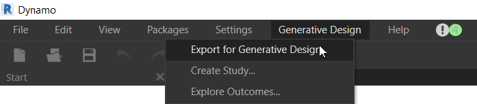

# Setting Up a Graph for Generative Design

## Inputs

To set up a Dynamo graph for use with generative design tools, right-click on each node used to drive the graph and ensure that the _`Is Input`_ option is ticked. Renaming the node with a standard approach such as _`IN_description`_ will help to distinguish these inputs in the Create Study dialog.

1. Right-click on each node used to drive the graph and ensure that the 'Is Input' option is ticked. 

Renaming the node with a standard approach such as _`IN_description`_ will help to distinguish these inputs in Generative Design.

_Note: Currently all inputs must be 'Number' slider nodes._

## Outputs

To define outputs for use with the generative design tools, right-click on the watch nodes and select the _`Is Output`_ option. Renaming the node with a standard approach such as _`OUT_description`_ will help to distinguish these outputs.

1. Right-click on the watch nodes and select the 'Is Output' option. 

Renaming the node with a standard approach such as _`OUT_description`_ will help to distinguish these outputs in Generative Design.

_Note: Currently all outputs must be watch nodes with a 'Number' data type._

## Export to Generative Design

Once both inputs and outputs are set up correctly and your graph is saved,  it can be exported for use with the generative design toolset.  In Dynamo, navigate to the toolbar and select _`Generative Design> Export for Generative Design`_

Dynamo will then create a copy of your graph which will be available to launch in with Create Study. 

To create an export to use with Generative Design, please do the following:

1. In Dynamo, navigate to the toolbar and select Generative Design &gt; Export for Generative Design. Generative Design will then create a copy of your graph which will be available to launch.

_Note: Graphs with the same name will be overwritten._

## Launch Generative Design

To launch Generative Design, please do the following:

1. In Dynamo, navigate to the toolbar and select Generative Design &gt; Create Study.

Once the Create Study dialog has launched, select a study that you have exported from Dynamo.

