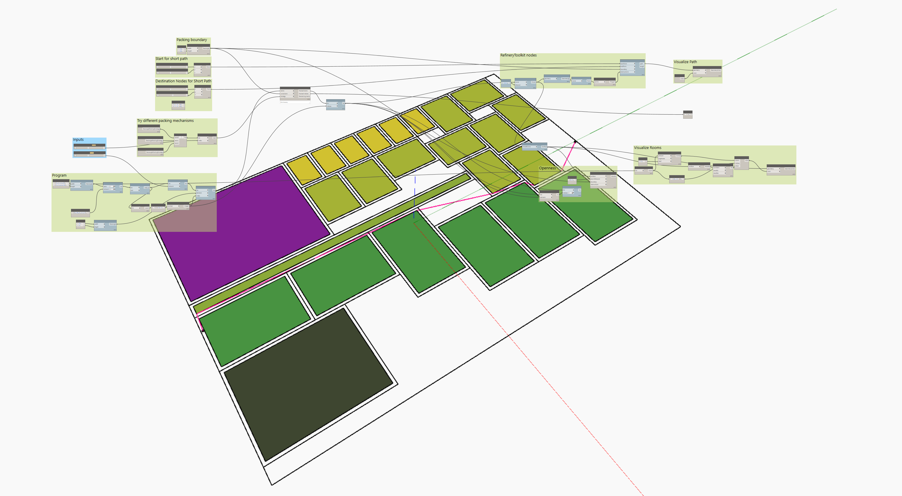
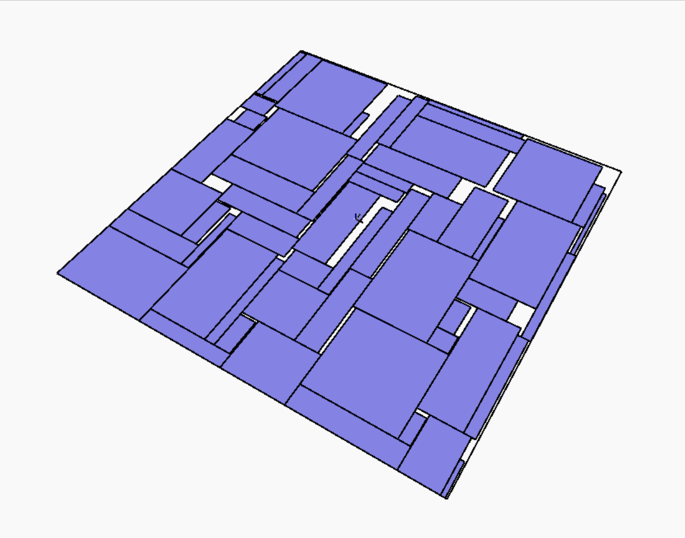
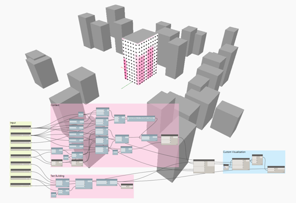

# Refinery Toolkit

The Refinery Toolkit is a collection of packages to accelerate generative design workflows in Dynamo.

## The toolkits

There are currently two packages included in the toolkit, each focusing on enabling specific types of workflows:

* SpacePlanning Toolkit
* Massing Toolkit

### Space Planning Toolkit

This toolkit offers a range of nodes that help with general space-planning workflows in Dynamo and Revit.

[Read more about the SpacePlanningToolkit](https://github.com/DynamoDS/RefineryToolkits/tree/master/src/SpacePlanning).

### Massing Toolkit

This toolkit offers resources and information about optimization and design option generation for massing.

[Read more about the MassingToolkit](https://github.com/DynamoDS/RefineryToolkits/tree/master/src/MassingSandbox).

[Read more about the MassingToolkit for Revit](https://github.com/DynamoDS/RefineryToolkits/tree/master/src/MassingRevit).

## For more Information

For more information on the Refinery Toolkit, please visit the following page:

[https://github.com/DynamoDS/RefineryToolkits](https://github.com/DynamoDS/RefineryToolkits)

