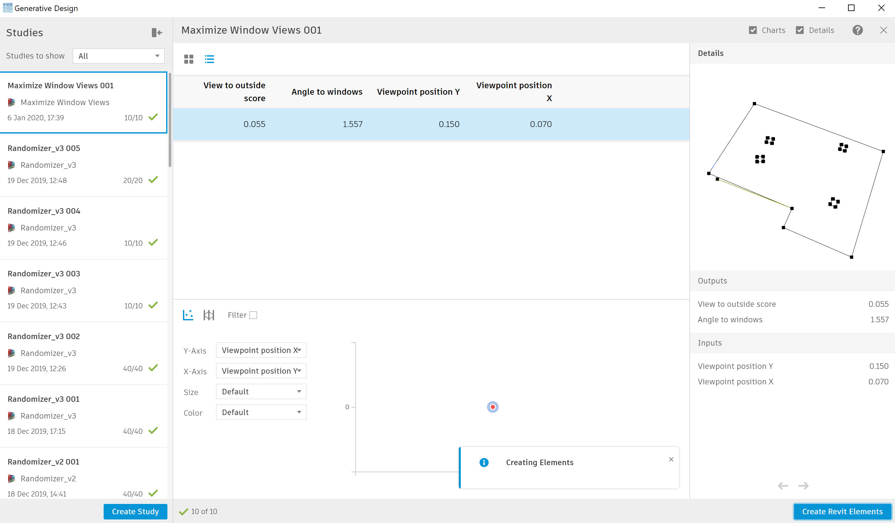

# Accessing Generative Design Directly from Revit

In  Revit 2021 you'll find a new add-in that lets you access generative design tools directly from Revit. This add-in is intended for users who are not familiar with Dynamo so that they can explore Generative Design without needing to create their own workflows \(similar to 'Dynamo Player'\).

## Accessing Generative Design

To access Generative Design in Revit, you'll need to do the following:

1. Firstly, go to the 'Manage' tab on your toolbar.

2. In the 'Generative Design' panel on this tab, you'll see are two options: 'Create Study' and 'Explore Results'. Open 'Create Study' to begin.

3. You will notice that examples of workflows previously created appear in this window. By default, Generative Design launches with a number of sample workflows. To proceed, select a workflow you want to try.

4. Follow the instructions for each section of the dialog. If a Revit input is required, select it in Revit and then return to the 'Create Study' dialog. If you're selecting multiple elements, make sure to press 'Finish' once you have selected all elements you want to include.

5. Once all inputs are satisfied, click 'Generate'. This will start the automated processing and present you with the same window you'll have seen from the`Create Study` function in the Dynamo environment. 

From here, you can explore all of your different options through the charts and tables. If you select a design, you can then export your results to Revit by clicking on the 'Create Revit Elements' button.

