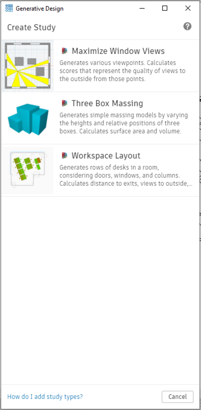
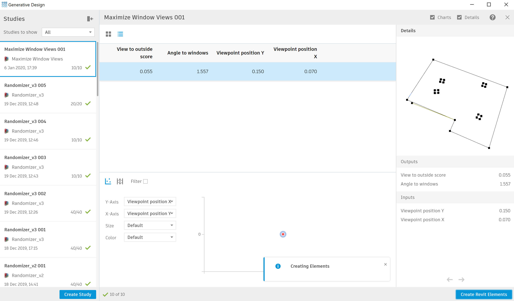

# Accessing Refinery Directly From Revit

In Revit preview release you would find a new plugin that may let you access Refinery directly from Revit. This plugin is intended for architects and stakeholders who are not familiar with Dynamo to be able to try Refinery’s potential without going into the nuts and bolts of Refinery’s workflows.

### Accessing Refinery

First, go to the `Manage` tab:

In the `Generative Design` panel there are two options, `Create Study` and `Explore Results` lets open `Create Study` to begin. 

Some examples of workflows created would appear in this section. Select a workflow you would like to try.

Follow the instructions for each section of the dialog. If a Revit input is required, select in Revit and then return to the Create Study dialog. When selecting multiple elements be sure to hit `Finish` once you have selected all elements. 

Generate designs and select a design. If you wish to export your result to Revit click on `Create Revit Elements`

