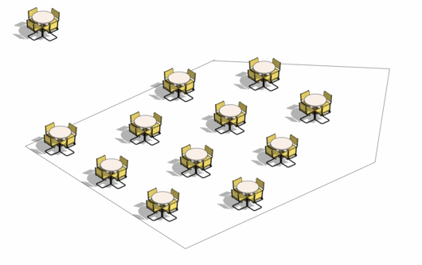

# Grid Object Placement in a Room

## Description

This graph uses Refinery on optimize mode to place objects along a room using grid formation. This graph will compare how the percent of coverage, the number of objects placed, and the overlap in area of influence perform as various grid configurations are tried through Refinery. This graph will help you automize the placement of repeating objects and although this is a simplified version of object placement you are encouraged to add personalized criteria that relates to your practice. All sample files for this example can be found in the \[PROVIDE LINK\] folder in the GitHub repository.

## Static inputs

| Input | Description |
| :--- | :--- |
| Room | Room in which objects are placed |
| Radius of influence | Object radius of influence for optimization calculation. |
| Minimum distance to wall | The minimum distance from object grid to wall. This sets a minimum for the random seed that determines the distance from wall where grid starts.  |
| Maximum distance to wall | The minimum distance from object grid to wall. This sets a maximum for the random seed that determines the distance from wall where grid starts.  |
| Minimum distance between objects | The minimum distance in between objects. This sets a minimum for the random seed that determines the distance in between objects. |
| Maximum distance between objects | The maximum distance in between objects. This sets a minimum for the random seed that determines the distance in between objects. |

\*Constrains for radius, minimum, and maximum values can only be changed using dynamo.

## Variable inputs

| Name | Description |
| :--- | :--- |
| Wall distance \(Seed\) | Gives a random value for the separation of the grid start to the wall. This value is constrained by the minimum and maximum distances to wall in the static input.  |
| Object Distance X \(Seed\) | Distance in between objects in grid's X axis. This value is constrained by the minimum and maximum distances between objects in the static input. |
| Object Distance Y \(Seed\) | Distance in between objects in grid's Y axis. This value is constrained by the minimum and maximum distances between objects in the static input. |

## Graph Description

The graph is made up of a series of functions, which are divided into groups inside the graph. Each group has a name and a short description, where the name indicates the type of function that is being run and the description explains in more detail the process. 

This graph will input a model element, a room and variables for placing a grid. The rooms surface and perimeter are used to calculate further metrics. Next, random values are given for the wall distance from the beginning of the grid, the grid X axis separation and Y axis separation. These values are used to create points distributed along the room. The graph then determines how each objects areas of influence overlap to each other and to the perimeter of the room.

Using optimization, the number of objects and the objects coverage is maximized while the object overlap and overlap to perimeter is minimized. 

## Evaluators

| Name | Description |
| :--- | :--- |
| Percent Coverage \(%\) | Percent of room covered by objects radius of influence |
| Area Coverage \(m2\) | Total area covered by objects radius of influence  |
| Number of Objects \(u\) | The number of objects placed in room |
| Total Object Overlap \(m2\) | Added overlap of both internal and external objects |
| Internal Object Overlap \(m2\) | Internal object overlap |

## Results

Refinery will display various grid configurations. In this example you can see results in the x and y axis according to their X and Y seed. Each result is showed as a point, the point’s size is determined by the number of objects of each result and the color is determined by their distance of objects to the perimeter.

In the image shown above you can see results given by Refinery for a study with a population of 20 designs after 10 generations. To enhance the visualization designs with more number of objects are depicted as bigger points. The color and y axis show the 

Once Refinery has completed, the results can be explored through the available tables and graphs. The image below shows an example output from an optimized study based on 4 generations with a population of 20.

