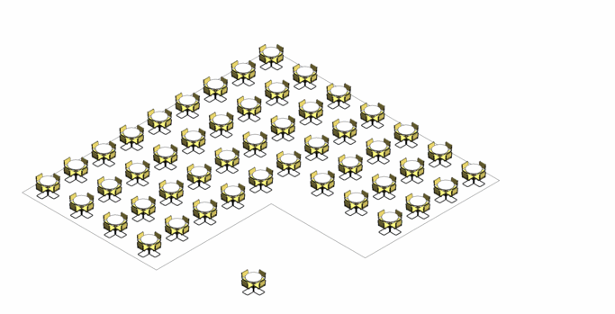

# Distribute Objects in a Room

## Description

This graph uses Refinery on optimize mode to place objects along a room using grid formation. This graph will compare how the percent of coverage, the number of objects placed, and the overlap in area of influence perform as various grid configurations are tried through Refinery. This graph will help you automize the placement of repeating objects and although this is a simplified version of object placement you are encouraged to add personalized criteria that relates to your practice. All sample files for this example can be found in the \[PROVIDE LINK\] folder in the GitHub repository.

## Static inputs

| Input | Description |
| :--- | :--- |
| Room | Room in which objects are placed |
| Radius of influence | Object radius of influence for optimization calculation. |
| Minimum distance to wall | The minimum distance from object grid to wall. This sets a minimum for the random seed that determines the distance from wall where grid starts.  |
| Maximum distance to wall | The minimum distance from object grid to wall. This sets a maximum for the random seed that determines the distance from wall where grid starts.  |
| Minimum distance between objects | The minimum distance in between objects. This sets a minimum for the random seed that determines the distance in between objects. |
| Maximum distance between objects | The maximum distance in between objects. This sets a minimum for the random seed that determines the distance in between objects. |

\*Constrains for radius, minimum, and maximum values can only be changed using dynamo.

## Variable inputs

| Name | Description |
| :--- | :--- |
| Wall distance \(Seed\) | Gives a random value for the separation of the grid start to the wall. This value is constrained by the minimum and maximum distances to wall in the static input.  |
| Object Distance X \(Seed\) | Distance in between objects in grid's X axis. This value is constrained by the minimum and maximum distances between objects in the static input. |
| Object Distance Y \(Seed\) | Distance in between objects in grid's Y axis. This value is constrained by the minimum and maximum distances between objects in the static input. |

## Graph Description

The graph is made up of a series of functions, which are divided into groups inside the graph. Each group has a name and a short description, where the name indicates the type of function that is being run and the description explains in more detail the process. 

This graph will input a model element, a room and variables for placing a grid. The rooms surface and perimeter are used to calculate further metrics. Next, random values are given for the wall distance from the beggining of the grid, the grid X axis separation and Y axis separation. This values are used to create points distributed along the room. The graph then determines how each objects areas of influence overlap to each other and to the perimeter of the room.

Using optimization the number of objects and the objects coverage is maximized while the object overlap and overlap to perimeter is minimized. 

## Visualization

When geometry is created in Dynamo, often other geometry is needed to facilitate the overall process. To ensure the geometry displayed shows the final geometric output, all unnecessary geometry has been switched off. Any nodes with the preview switched off will not display the output visually in Refinery. In this case, only the obstructing geometry, light sources and final coloured analysis points are visible. The analysis points are coloured from blue \(less illuminated\) to red \(more illuminated\).

## Evaluators

| Name | Description |
| :--- | :--- |
| Light sources | Amount of light sources/fixtures resulting on the room |
| Lit spots | Amount of overall illuminated analysis points |
| Overlit spots | Amount of overlit analysis points |

## Benefits of Using Refinery

Without the aid of refinery the designer would usually place light sources evenly distributing them along spaces to later perform lighting calculations. In regular shaped rooms this method produces good results but things can get complicated if rooms have irregular shapes that may result in blind spots. Refinery using an optimization method can speed up how light sources are distributed.

## Results

Once Refinery has completed, the results can be explored through the available tables and graphs. The image below shows an example output from an optimized study based on 10 generations with a population of 20. The outputs were defined as minimized for both _`underlit spots`_ and _`overlit spots`_

