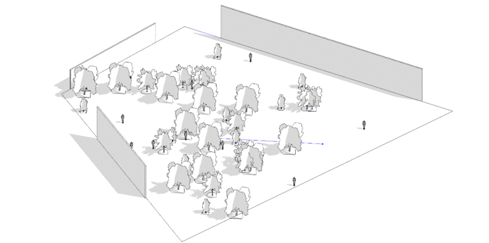
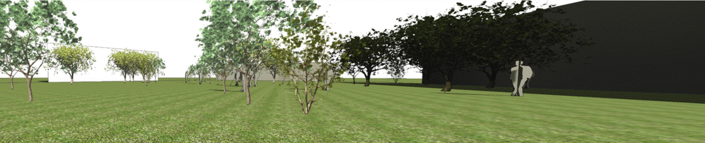
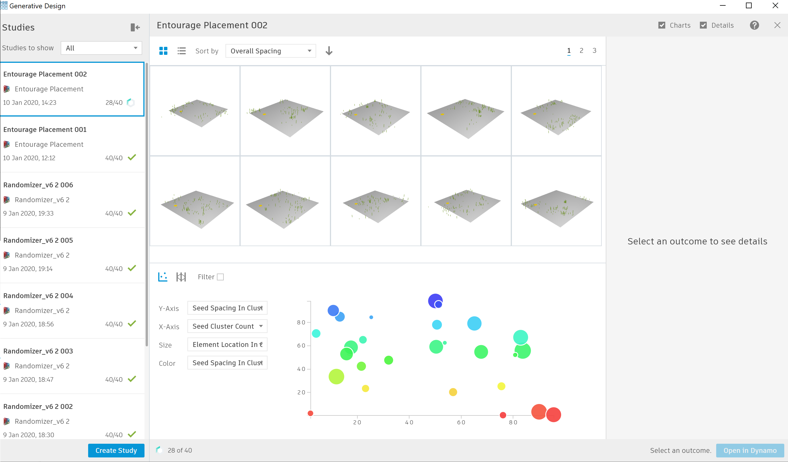
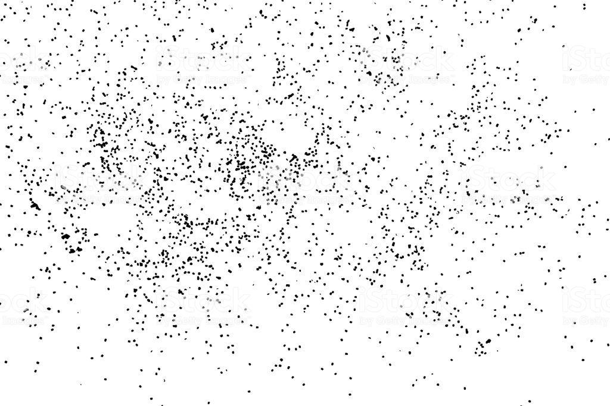

# Entourage Placement Exploration

## Description

This graph will generate a series of scenes with different entourage elements. Entourage elements are placed in clusters. You input a space and entourage elements, you control different cluster parameters, and review metrics related to your view.

You would be able to save time by quickly scaning throught scenes and updating entourage elements, and avoid loosing time placing elements individually.

_The sample files for this example can be found in the  `PROVIDE LINK` folder in the Github repository._ 

## Static inputs

| Name | Description |
| :--- | :--- |
| Room | Select a room to place entourage |
| Families for Entourage | Select one family instance for each element you want to include in your entourage |
| 3d View | Select a 3d view that you would be working. |

## Constrains

| Name | Description |
| :--- | :--- |
| Min/Max cluster count | Range for amount of clusters |
| Min/Max spacing per cluster | Range of spacing per each cluster |
| Min/Max elements per cluster | Range of amount of elements per cluster |

## Variable inputs

| Name | Description |
| :--- | :--- |
| Seed cluster count | Determines amount of clusters  |
| Seed cluster Us/Vs | Determines UV position of each cluster |
| Seed Spacing in Cluster | Determines spacing for each cluster |
| Seed Elements per cluster | Determines amount of elements in each cluster |
| Seed Element location | Determines element location per cluster |

## Functions

The script is made up of a series of functions, which are divided into groups inside the graph. Each group has a name and a short description. The name indicates the type of function that is being run and the description explains in more detail the process. 

The script would start by extracting the view position and direction. Every time you change the view you would also need to change the boolean node next to it to keep it up to date. It would store this location as your point of interest and metrics would relate to this location. The script would also extract the surface of a room. This room would be used to place the entourage elements. The script would continue to create a series of clusters of elements given the constrains that you give it. It would then filter and place only the elements that are inside the designated room. The script would continue by randomly assigning a family instance to each point. Metrics would be calculated relating  the new family instances created and the point of interest. 

## Visualization

Refinery would display the surface of the room selected, the point of interest and the entourage elements as lines. We suggest you combine this with the 3d view used so that you get results as you export them to dynamo.

## Evaluation

There is no optimization but some metrics give you information of the scenes created.

| Name | Description |
| :--- | :--- |
| View obstructions | The total area occupied by the amenity spaces |
| Distance to camera | Added distance of entourage elements to the view camera |
| Overall spacing | How far apart are elemets to each other |

## Results

Once Refinery has completed, the results can be explored through the available tables and graphs   
 The image below shows an example output from a randomized study based on 40 solutions.

## A More Organic Random Using Gaussian Distribution

One of the key elements to understand when placing elements randomly is Gaussian distribution. By using Gaussian normal distribution instead of the regular random method you can control the clustering of elements and your placement would feel more organic. 

For further reading on this subject please refer to the following link:

* [https://natureofcode.com/book/introduction/](https://natureofcode.com/book/introduction/) 

