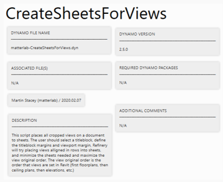
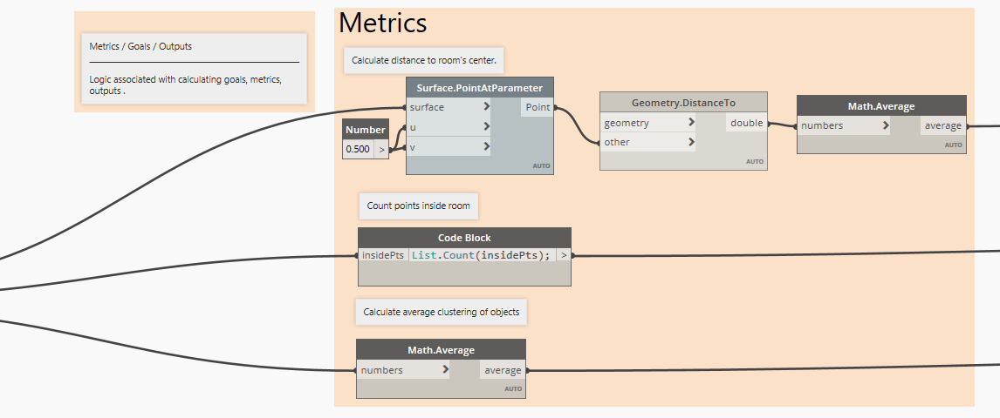

# Community Examples

In the future we want the community to submit their generative design case studies to this primer. This chapter will showcase these cases so they will be available as examples for the wider generative design/Refinery community.

The submitted case studies should show the process from start to finish and highlight the benefits of working with generative design.

## Guidelines for Submitting Changes on the Primer

If you have any suggestions for the primer, we will gladly review them! To do so, please follow the guidelines in the following link:

[https://github.com/DynamoDS/RefineryPrimer/blob/master/CONTRIBUTING.md](https://github.com/DynamoDS/RefineryPrimer/blob/master/CONTRIBUTING.md)

## Guidelines for Submitting Sample Files

To ensure that the sample files presented in this page are easy to understand, we recommend you follow these general guidelines:

### Create a Title Block

This title block will help the user identify all the requirements needed to run the workflow \(Revit version, required dynamo packages, etc.\). The title block will also display observations that help explain what the workflow does, and how is it useful.  

> You can copy a panel from an existing document and change the information in it so it suits your workflow

### Organize Nodes Into Groups

Organizing nodes into groups will help the user understand how the workflow is structured. Groups should have comments that indicate the general purpose of the group of nodes.

### Follow Color Guidelines

We use a consistent color pallet through out our workflows. Don't forget to follow this color pallet in your workflow:

####  Inputs - Pink

#### Generators - Green

#### Display - Blue

#### Metrics - Orange

#### Remember/Gate - Purple 

