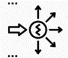

# What Generative Design Can’t Be Used For?

If you are someone who wants to implement Refinery in your office it is really important to define what Generative Design can and cannot do. Otherwise people would expect Generative Design to solve every problem that they have and would be hugely disappointed when the results are not what they want.

### **Myths and Misconceptions:**

Although Generative Design is great at solving problems, there are certain problems that are usually assigned to Generative Design that should not be. Some of the common mistakes are:

### **Evident Solutions**

There is a danger of overusing refinery for problems that are really straightforward. If you intend to solve an optimization problem in which the answer is obvious, then you don’t need refinery. Lets say that you are trying to maximize volume of a box, if you don’t have any more complex criteria to optimize, most of the answers would tend to maximize x,y and z. Although this is answer is solvable through refinery, it would only be relevant if conflicting criteria is added.

### Confusing visual programming \(dynamo\) problems with \(generative design\) refinery problems.

Even though refinery works with dynamo it is important to differentiate between problems that need a certain answer and problems that need exploration. If you intend on solving a problem that has a definite answer use dynamo, if you intend to explore solutions use refinery.

### Problem is not defined in terms of variables

A refinery problem needs a set of variables/ inputs that may have variety to function. If you cannot have variety of inputs then refinery is left with no space to work on.

### There is no clear correlation between how inputs affect optimization criteria

If there is no definite relation between how inputs affect optimization then refinery can be misguided into interpreting variables in a way that they are not intended. May develop results that were misguided by the malfunctioning workflow.

