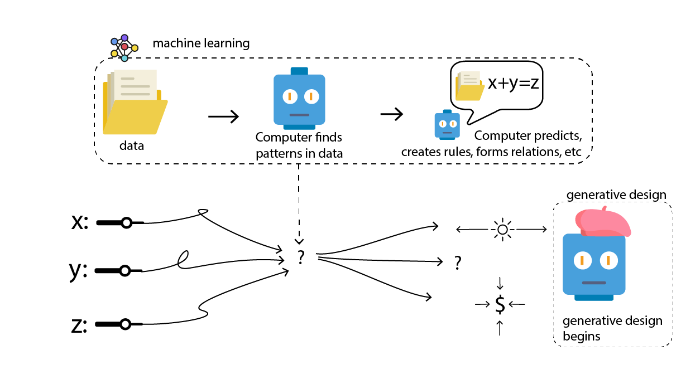

# Can Machine Learning and Generative Design Work Together?

Machine learning can be a great tool for complementing generative design with the use of big data.

If we have complex relations between how our inputs affect our desired optimisation results, machine learning can take a really big role in defining how data is correlated.

## Examples of Machine Learning in Architecture

### Predicting Solar Radiation 

In the following example, made by Thedore Galanos and Angelos Chronis from [CIT Lab](https://cities.ait.ac.at/site/), solar radiation is predicted by examining solar radiation of previous studies. By this method real examples of buildings are used to create a model of solar radiation that may be used in non-contracted buildings.

