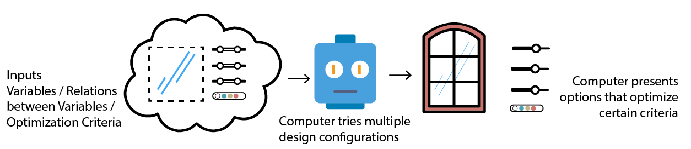

# Is Generative Design Machine Learning?

Although many people are using machine learning as a marketing buzz word it is important to differentiate between the terms generative design and machine learning. So as a quick answer, No, generative design is not machine learning. While machine learning is used to analyse. Generative design creates/generates.

### Machine Learning

### Generative Design

The diagram above shows how these terms defer in terms of procedure. You can think of a machine learning as a pattern finder and generative design as a creator.

